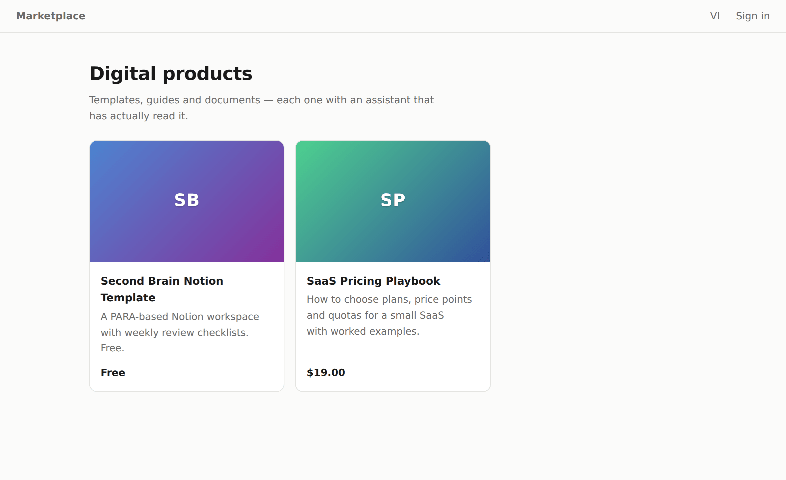
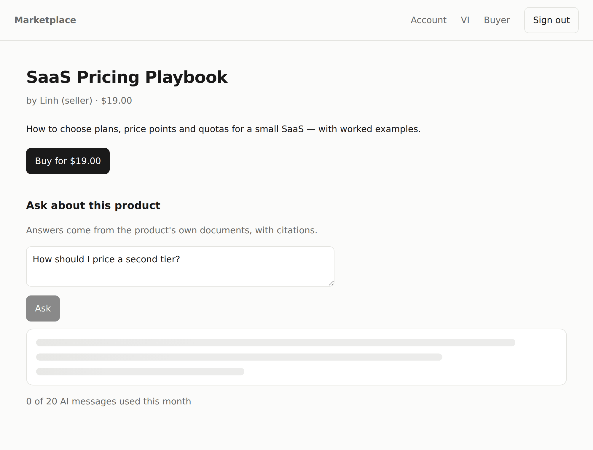
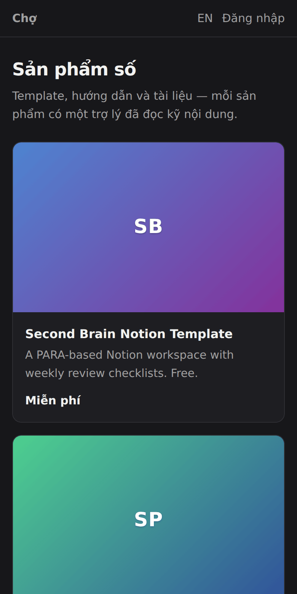
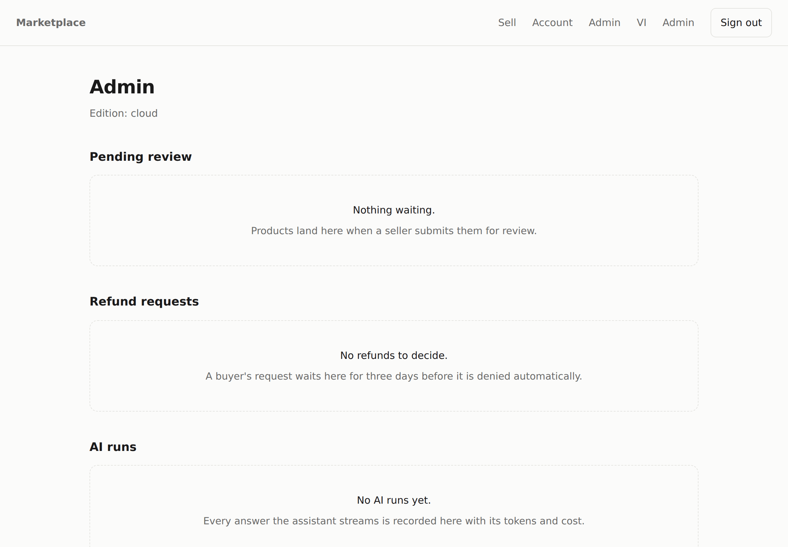

# digital-marketplace

A marketplace for digital products where every listing comes with an
assistant that has actually read it. Sellers upload a document, buyers purchase
it once or subscribe, and questions get answered from the document itself —
with citations. Reviews and refunds are durable workflows that wait for a
human. English and Vietnamese.

Built on four libraries extracted from it:

| Library | What it owns here |
|---|---|
| [agent-runtime](https://github.com/tientran1234/agent-runtime) | the "ask about this product" agent: tools, quota gate, streaming, tracing with cost |
| [durable-workflow](https://github.com/tientran1234/durable-workflow) | product review (waits up to 7 days for an admin) and refunds (waits for a decision, then calls the provider with retries) |
| [subscription-billing](https://github.com/tientran1234/subscription-billing) | the billing design: idempotent webhooks, forward-only state machines, entitlements derived on read |
| [offline-license](https://github.com/tientran1234/offline-license) | the self-hosted edition: admin area gated by a signed license, no phone-home |

The RAG pipeline (structure-aware chunking → embeddings → pgvector → MMR
re-ranking) lives in `src/rag/` and runs on Postgres alone — no vector service.
Uploads are `.md`, `.txt` or `.pdf`; `server/extract.ts` flattens a PDF to text
before the chunker sees it, and refuses a scan with no text layer rather than
indexing an empty document. The file itself goes through `server/storage.ts`:
local disk in dev, an S3-compatible bucket (R2, MinIO, AWS S3) wherever the
`S3_*` variables are set — SigV4 signed by hand, no SDK.

## Flows

**Sign in.** `POST /api/auth/request-link` answers 204 for every address — a
different answer for one that has an account would list our customers — and
emails a link. Only the link's SHA-256 is stored: the link itself is already
in a mailbox and in whatever logged the URL, so the row on its own opens
nothing. `GET /api/auth/callback` redeems it — valid, consumed or expired,
decided in `domain/magic-link.ts` — and claims it with an `UPDATE … WHERE
consumedAt IS NULL`, so two clicks leave one winner, the same way the webhook
table's insert is the lock. The account is created there rather than when the
address was typed, because until the link comes back all anyone has done is
type an address. It is created as a BUYER: a link proves an address, it does
not hand out a role. What comes out is the same opaque session row in the same
table as before.

**Buy.** `POST /api/checkout/order` persists a `PENDING` order *before*
calling Stripe, so a webhook that beats the response still finds it. Stripe's
`checkout.session.completed` arrives at `POST /api/webhooks/stripe`: raw body
→ signature → event id claimed in `WebhookEvent` (the insert is the lock) →
`UPDATE … WHERE status IN (PENDING)`. A replayed delivery is a `duplicate`;
two racing deliveries produce one winner. Download access is one pure function
(`domain/access.ts`) used by both the button and the file route, so they can
never disagree.

**Ask.** `POST /api/products/:id/ask` streams SSE. Before the model is called:
plan check (`ask_ai`), then monthly quota incremented in the database — and
refunded if the provider fails before a single token reaches the buyer, though
a run that dies half way through an answer still costs the message. The agent
has two tools — `search_docs` (retrieve + MMR over the product's chunks) and
`product_facts` — a hard cap of six iterations, and a tracer that writes every
run's spans, tokens and cost to `AgentTrace` for the admin page.

**Review.** Submitting a product starts the `product-review` workflow: mark
pending, wait for the `review` signal (7-day timeout → rejected), publish or
reject. The run lives in `workflow_runs`; a deploy in between changes nothing.

**Refund.** The buyer's request starts `refund-request`: wait for an admin
`decision` (3 days → denied); on approval, `issue-refund` calls the provider
inside a retried step. The order's status is *not* changed by the workflow —
it changes when `charge.refunded` arrives, through the same webhook path as
every other status change. One place changes money state.

**Measure.** The sell page shows each listing's views, purchases and questions
asked — a Pro feature, gated by `canUse(ent, "seller_analytics")` before the
query runs rather than after it. Two of the three numbers were already in the
database (orders, and the traces the ask box writes); views get a `ProductView`
row per product per UTC day, incremented in the database, and a seller
reloading their own listing is not an audience. A purchase is money that
stayed, so a refunded order stops counting as a sale.

**Serverless worker.** There is no resident process on Vercel, so
`POST /api/workflows/tick` processes due runs and `vercel.json` schedules it
(daily on Hobby — point cron-job.org at it every few minutes for real use). Signals (`admin approves`) resume runs immediately without
waiting for the tick.

## Run it

```bash
pnpm install
cp .env.example .env            # DATABASE_URL needs pgvector; Neon has it, so does `pnpm db:up`
pnpm db:setup                   # Prisma schema + vector extension + workflow table
pnpm db:seed                    # three users, two indexed products — no API keys needed
pnpm dev                        # http://localhost:3000/en  (sign-in links print to this terminal)
```

With keys: `ANTHROPIC_API_KEY` turns on the real assistant (Claude via
agent-runtime), `VOYAGE_API_KEY` turns on real embeddings (without it, a
bag-of-words hasher stands in — fine for a demo, useless for real search),
`STRIPE_*` turns on real checkout (`pnpm stripe:listen` for the webhook), and
`S3_*` moves product files off the local disk into a bucket, and
`RESEND_API_KEY` + `MAIL_FROM` send sign-in links as real email instead of
printing them. Setting some but not all of the `S3_*` variables — or one of
the two mail variables — is an error rather than a fallback.

Sign in as `buyer@`, `seller@` or `admin@example.test` to reach those screens:
the seed gives them their roles, and the link only proves the address.

```bash
pnpm test                       # 83 unit tests anywhere; 13 flow tests need DATABASE_URL
pnpm test:e2e                   # the two buyer flows in Chromium — needs DATABASE_URL too
pnpm eval                       # 40 questions over the seed docs — recall@5 and answer correctness
pnpm typecheck && pnpm build
```

**End to end.** `e2e/` drives a production build in a browser: buy → webhook
→ download, and ask → cited answer. It covers the seams the flow tests reach
past — the button posting to the checkout route, the webhook arriving as raw
signed bytes, the file landing on disk, the agent's tool call and citations
arriving over SSE. Stripe, the model and the embedder are the same doubles the
flow tests inject, selected here by `FAKE_PROVIDERS=1` because a browser
cannot reach into the process to install them; a real key alongside that flag
is an error rather than a silent preference either way. The stand-in model can
only quote what `search_docs` returned, so the ask spec takes the passage the
answer cites and looks for it in the product's own chunks: an answer that is
not in pgvector is an answer that did not come from the document. Sign-in is
the real emailed link, read off the server's log — the only place it exists
outside a mailbox, since the database keeps its SHA-256.

**Evals.** `evals/` asks forty questions of the two seed documents, each one
naming the passage that answers it and the fact the answer must carry. It runs
the real chunker, embedder, MMR and agent prompt against an in-memory index, so
it needs no database and no key; `EVAL_MODEL=1` swaps the extractive baseline
for the real model. Numbers and what they mean: [`evals/README.md`](evals/README.md).

## The UI



Colour, space, radius and type are tokens in `app/[locale]/globals.css` and
dark mode redefines the surface, so a change is one line rather than a
find-and-replace. A product carries a document, not artwork, so its cover is
derived from the slug — a fixed gradient and the title's initials, the same on
the server and in the browser, with no column to fill and no upload to wait
for. The grid reflows to one column on a phone.

 

Retrieval runs before the assistant's first token, so the ask box shows
skeleton lines rather than a spinner that lies about how long this takes —
held still for anyone who asked for reduced motion.



Every "nothing here yet" says what is missing and what will fill it, in both
languages, instead of one grey sentence or a table of headers with no rows.

## Layout

```
src/
  domain/        pure: billing events, order + subscription state machines, plans, download access, seller analytics, sign-in link rules
  providers/     stripe.ts (the only file importing stripe) · s3.ts (SigV4 by hand) · resend.ts (one POST) · fake.ts (the billing double, the extractive model, and the flag that serves them)
  rag/           chunk · embed (Voyage, hash) · mmr · store (pgvector, raw SQL) · retrieve
  lib/           db · pg · env · money formatting · cover (the grid's derived gradients)
  server/        billing · workflows · assistant · auth (opaque sessions) · magic-link · mail · usage · analytics · license · storage · extract
  app/api/       auth (request-link/callback/logout), checkout, webhooks, products (upload/submit/ask/download), orders/refund, admin, workflows/tick
  app/[locale]/  marketplace, product, account, sell, admin, login — en + vi
  components/    the client bits: SSE reader, checkout buttons, forms · empty state
tests/           domain, rag, upload extraction, storage keys + S3 signing, sign-in links + mailer choice, stripe mapping, evals, the fake-provider seam, and the flows on real Postgres
e2e/             playwright: buy → webhook → download, ask → cited answer, in a browser
evals/           the assistant eval suite: questions · harness · report
scripts/         setup-db, seed, seed-docs (the corpus the evals ask about)
```

## What is deliberately not here

- **Passwords and OAuth.** Sign-in is an emailed link and nothing else. There
  is no password to leak, reset or rate-limit, and no provider buttons to keep
  working. A product that needs "Sign in with Google" needs another way into
  `issueSession`, not another session layer.
- **Seller payouts.** Stripe Connect is a project of its own.
